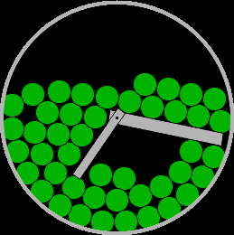

# ball_sim_watchface

I always like messing with physics sims and bought a Round 2 recently, so I decided to try and make a watchface combining them!

<video src="screenshots/msrdc_16-06-2026_03-25-19.mp4" controls width="250" height="250">
	Your browser does not support the video tag
</video>
Sample video with the minute hand moving every second

### Features:
- Ball color for battery precentage (green >40%, yellow >20%, red <20%)
- Border + hands turn blue when bluetooth is disconnected
- Physics (Verlet Integration, 30fps)

### Planned/Possible Features:
- Have gravity depend on watch orientation
- Tap to apply force to balls

### Tested Platforms:
- TESTING IS WELCOME FROM OTHERS
- gabbro (Round 2, Emulator)
